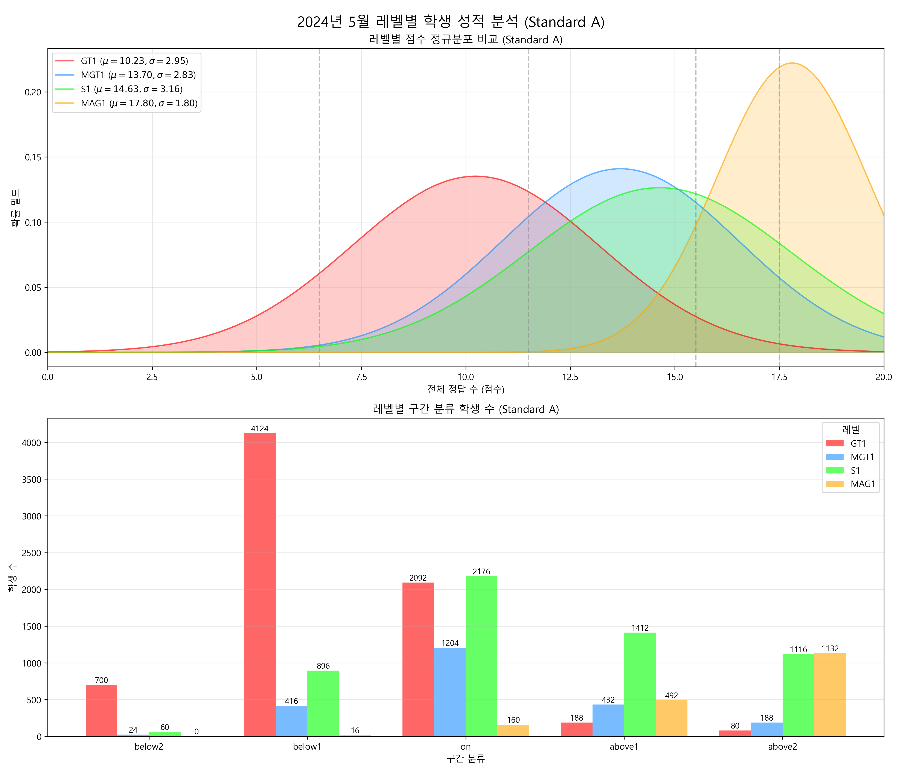
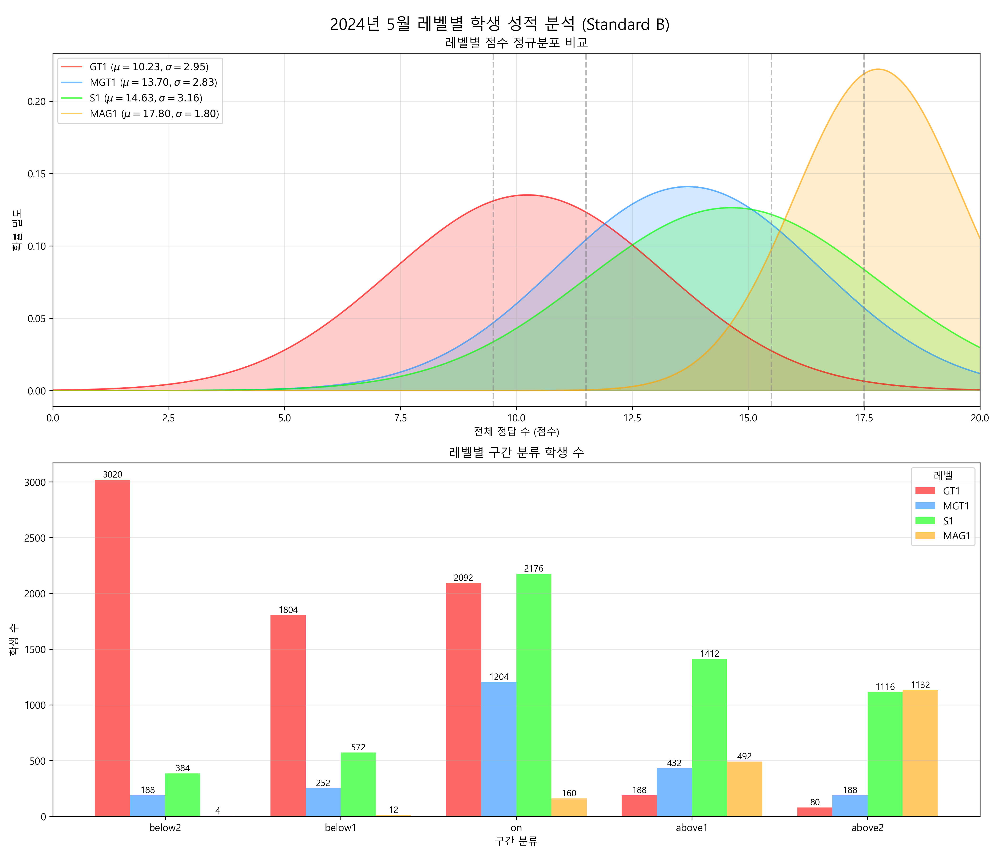

# 2024년 5월 레벨별 학생 성적 분석 비교 (Standard A, B, C)

## 기준 비교

### Standard A (standard_test_A_GPT)
**점수 기준(20문항)**
- below2: 0~6
- below1: 7~11
- on: 12~15
- above1: 16~17
- above2: 18~20

**백분위**
- below2: 0~30%
- below1: 35~55%
- on: 60~75%
- above1: 80~85%
- above2: 90~100%

---

### Standard B (standard_test_B_GPT)
**점수 기준(20문항)**
- below2: 0~9
- below1: 10~11
- on: 12~15
- above1: 16~17
- above2: 18~20

**백분위**
- below2: 0~20%
- below1: 21~40%
- on: 41~70%
- above1: 71~90%
- above2: 91~100%

---

### Standard C (standard_test_C)
**점수 기준(20문항)**
- below2: 0~6
- below1: 7~11
- on: 12~15
- above1: 16~17
- above2: 18~20

**백분위**
- below2: 0~30%
- below1: 35~55%
- on: 60~75%
- above1: 80~85%
- above2: 90~100%

---

## 학생 수 비교

### Standard A
| 레벨 | below2 | below1 | on | above1 | above2 | Total |
|---|---|---|---|---|---|---|
| GT1 | 700 | 4124 | 2092 | 188 | 80 | 7184 |
| MGT1 | 24 | 416 | 1204 | 432 | 188 | 2264 |
| S1 | 60 | 896 | 2176 | 1412 | 1116 | 5660 |
| MAG1 | 0 | 16 | 160 | 492 | 1132 | 1800 |

### Standard B
| 레벨 | below2 | below1 | on | above1 | above2 | Total |
|---|---|---|---|---|---|---|
| GT1 | 3020 | 1804 | 2092 | 188 | 80 | 7184 |
| MGT1 | 188 | 252 | 1204 | 432 | 188 | 2264 |
| S1 | 384 | 572 | 2176 | 1412 | 1116 | 5660 |
| MAG1 | 4 | 12 | 160 | 492 | 1132 | 1800 |

### Standard C
| 레벨 | below2 | below1 | on | above1 | above2 | Total |
|---|---|---|---|---|---|---|
| GT1 | 700 | 4124 | 2092 | 188 | 80 | 7184 |
| MGT1 | 24 | 416 | 1204 | 432 | 188 | 2264 |
| S1 | 60 | 896 | 2176 | 1412 | 1116 | 5660 |
| MAG1 | 0 | 16 | 160 | 492 | 1132 | 1800 |

---

## 시각화

### Standard A

### Standard B

### Standard C

---

## 주요 차이점

- **Standard A와 C**: 동일한 점수 기준 사용 (0-6, 7-11, 12-15, 16-17, 18-20) → 학생 수 분포 동일
- **Standard B**: 다른 점수 기준 사용 (0-9, 10-11, 12-15, 16-17, 18-20) → below2와 below1 구간에서 다른 분포
  - GT1: below2가 3020명 (A/C는 700명), below1이 1804명 (A/C는 4124명)
  - MGT1: below2가 188명 (A/C는 24명), below1이 252명 (A/C는 416명)
  - S1: below2가 384명 (A/C는 60명), below1이 572명 (A/C는 896명)
  - MAG1: below2가 4명 (A/C는 0명), below1이 12명 (A/C는 16명)
